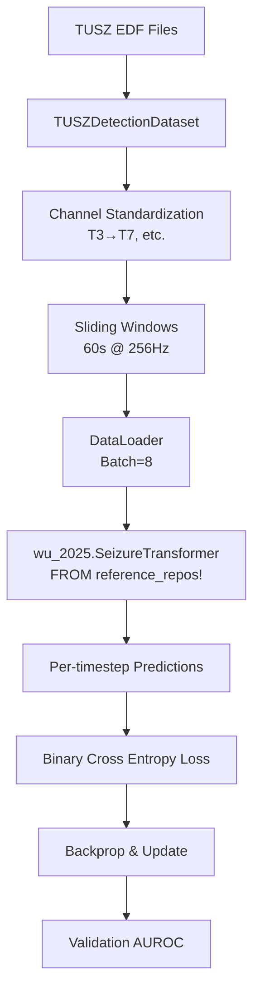

# 🔴 CURRENT SEIZURE TRANSFORMER DATAFLOW (What We Built)

**Status**: RUNNING but potentially incorrect
**Created**: December 12, 2024
**Purpose**: Document EXACTLY what we're doing now vs what we should be doing

---

## 📍 Current Implementation Path

### 1. WHERE THE MODEL LIVES
```
reference_repos/SeizureTransformer/wu_2025/
├── src/wu_2025/
│   └── architecture.py  # The ACTUAL SeizureTransformer code (41M params)
└── pyproject.toml       # Package definition
```

**PROBLEM**: We're importing DIRECTLY from reference_repos via:
```python
# experiments/seizure_transformer/train_tusz.py
from wu_2025.architecture import SeizureTransformer  # BAD - pulls from reference_repos!
```

This happened because we did:
```bash
cd reference_repos/SeizureTransformer/wu_2025
uv pip install -e .  # This makes wu_2025 importable globally!
```

### 2. OUR WRAPPER
```
src/brain_go_brrr/infra/ml_models/seizure_transformer_wrapper.py
```
- ✅ Has preprocessing logic
- ✅ Has post-processing logic  
- ❌ BUT doesn't actually contain the model architecture
- ❌ Still would need to import from wu_2025 package

### 3. DATASET LOADER
```
src/brain_go_brrr/infra/data/tusz_detection_dataset.py
```
- ✅ Loads TUSZ EDF files
- ✅ Handles channel aliasing (T3→T7, etc.)
- ✅ Creates sliding windows
- ✅ Memory-efficient loading with max_windows
- ⚠️ Pads missing channels with zeros (is this correct?)

### 4. TRAINING SCRIPT
```
experiments/seizure_transformer/train_tusz.py
```
- ✅ Uses TUSZDetectionDataset from src/
- ❌ Imports SeizureTransformer from wu_2025 package (reference_repos)
- ✅ Implements training loop
- ✅ Has AUROC validation

### 5. POST-PROCESSING
```
src/brain_go_brrr/infra/eval/post_processing.py
```
- ✅ AdvancedPostProcessor with hysteresis thresholding
- ✅ Gap merging
- ✅ Duration filtering
- ✅ Confidence scoring

---

## 🔄 Current Data Flow



---

## ⚠️ KEY ISSUES

### 1. **ARCHITECTURE VIOLATION**
We're importing from `reference_repos/` which should be .gitignored reference material only!

### 2. **MISSING PREPROCESSING**
The OSS repo does:
- Z-score normalization
- Bandpass filter (0.5-120Hz)
- Notch filter (1Hz, 60Hz)

We're NOT doing these in the dataloader!

### 3. **MONTAGE CONFUSION**
- SeizureTransformer REQUIRES unipolar/referential montage
- We're not explicitly checking or converting bipolar→unipolar
- Just padding missing channels with zeros

### 4. **MISSING CLINICAL METRICS**
- No FA/24h calculation
- No TAES (Time-Aligned Event Scoring)
- No NEDC integration
- Only tracking AUROC

### 5. **POST-PROCESSING MISMATCH**
OSS uses:
- Threshold: 0.8
- Morphological ops (specific kernel sizes)
- Remove events < 2s

We have the structure but different parameters

---

## 📊 What's Actually Training

```python
# Current training statistics
Train samples: 10,000 windows (limited for memory)
Val samples: 5,000 windows
Batch size: 8
Model: 41M parameters
Speed: ~2 batches/second on GPU
Loss: Binary Cross Entropy per timestep
```

---

## 🚨 CRITICAL QUESTIONS

1. **Should we copy the architecture to src/?** 
   - YES - reference_repos should not be imported from

2. **Are we preprocessing correctly?**
   - NO - missing filters and normalization

3. **Is the model seeing the right data?**
   - MAYBE - channels are mapped but preprocessing is wrong

4. **Will we match paper performance?**
   - UNLIKELY - different preprocessing, no clinical metrics

---

## 🔧 Required Fixes

1. **COPY** architecture from reference_repos → src/brain_go_brrr/infra/ml_models/
2. **ADD** proper preprocessing pipeline
3. **IMPLEMENT** NEDC evaluation metrics
4. **ENSURE** unipolar montage
5. **MATCH** OSS post-processing parameters

---

**THIS IS WHAT WE'RE ACTUALLY DOING RIGHT NOW**