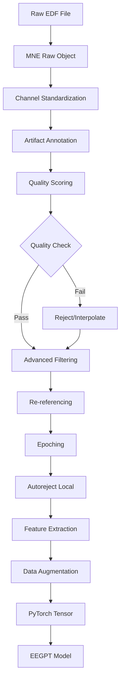

> ⚠️ **ARCHIVED DOCUMENTATION** - Code examples may be outdated.
> For safe torch.load/save patterns, see [TRAINING.md](../../TRAINING.md#safe-checkpoint-loading).
> Never use torch.load without weights_only parameter in production code.


# MNE Preprocessing Pipeline for EEGPT Training

> ⚠️ **ARCHIVED DOCUMENT - DO NOT USE FOR CURRENT DEVELOPMENT**
> This document is preserved for historical reference only.
> For current documentation, see [docs/README.md](../../README.md)
> Archive date: September 2, 2025

---


## Overview

This document details the specific MNE preprocessing pipeline to be implemented for improving TUAB/TUEV training data quality. Each step includes rationale, implementation details, and expected impact on model performance.

## Pipeline Architecture



## Detailed Pipeline Steps

### Step 1: Data Loading & Validation

```python
def load_and_validate_eeg(file_path: Path) -> mne.io.Raw:
    """Load EDF with comprehensive validation."""

    # Load with MNE
    raw = mne.io.read_raw_edf(
        file_path,
        preload=True,
        stim_channel=None,
        exclude=[],  # Don't exclude any channels initially
        verbose='WARNING'
    )

    # Validate sampling rate
    if raw.info['sfreq'] < 250:
        raw.resample(256)  # Standardize to 256 Hz for EEGPT

    # Check for required channels
    required = ['FP1', 'FP2', 'F3', 'F4', 'C3', 'C4', 'P3', 'P4', 'O1', 'O2']
    missing = [ch for ch in required if ch not in raw.ch_names]
    if len(missing) > 4:  # Allow up to 4 missing channels
        raise ValueError(f"Too many missing channels: {missing}")

    # Set channel types
    raw.set_channel_types({ch: 'eeg' for ch in raw.ch_names})

    # Apply standard montage
    montage = mne.channels.make_standard_montage('standard_1020')
    raw.set_montage(montage, on_missing='warn')

    return raw
```

### Step 2: Artifact Detection & Annotation

```python
def detect_artifacts_comprehensive(raw: mne.io.Raw) -> mne.io.Raw:
    """Comprehensive artifact detection using MNE methods."""

    # 1. Muscle artifacts (EMG contamination)
    muscle_annotations = mne.preprocessing.annotate_muscle_zscore(
        raw,
        threshold=4.0,
        ch_type='eeg',
        min_length_good=0.2,
        filter_freq=(110, 140)
    )
    raw.set_annotations(raw.annotations + muscle_annotations)

    # 2. Eye movement artifacts
    eog_events = mne.preprocessing.find_eog_events(
        raw,
        ch_name=None,  # Auto-detect EOG from frontal channels
        event_id=998,
        l_freq=1,
        h_freq=10
    )

    # 3. Bad channel detection (multiple methods)

    # Method A: Correlation-based
    def find_bad_by_correlation(raw, threshold=0.4):
        data = raw.get_data()
        corr = np.corrcoef(data)
        avg_corr = np.mean(np.abs(corr), axis=0)
        return [raw.ch_names[i] for i in np.where(avg_corr < threshold)[0]]

    # Method B: Variance-based
    def find_bad_by_variance(raw, z_threshold=3):
        data = raw.get_data()
        variances = np.var(data, axis=1)
        z_scores = np.abs(zscore(variances))
        return [raw.ch_names[i] for i in np.where(z_scores > z_threshold)[0]]

    # Method C: MNE's RANSAC-based detection
    from autoreject import Ransac
    ransac = Ransac(n_jobs=1, random_state=42)
    epochs_temp = mne.make_fixed_length_epochs(raw, duration=4.0, preload=True)
    ransac.fit(epochs_temp)
    bad_channels_ransac = ransac.bad_chs_

    # Combine all bad channel detections (voting system)
    bad_corr = find_bad_by_correlation(raw)
    bad_var = find_bad_by_variance(raw)
    bad_channels = list(set(bad_corr + bad_var + bad_channels_ransac))

    # Mark bad channels
    raw.info['bads'] = bad_channels

    # 4. Annotate flat segments (no signal)
    flat_annotations = mne.preprocessing.annotate_flat(
        raw,
        threshold=1e-15,  # Essentially zero signal
        min_duration=0.5
    )
    raw.set_annotations(raw.annotations + flat_annotations)

    return raw
```

### Step 3: Quality Metrics Computation

```python
def compute_quality_metrics(raw: mne.io.Raw) -> Dict[str, float]:
    """Compute comprehensive quality metrics for the recording."""

    metrics = {}

    # 1. Signal-to-Noise Ratio (SNR)
    # Compute PSD
    psd, freqs = mne.time_frequency.psd_welch(
        raw,
        fmin=0.5,
        fmax=50,
        n_fft=2048,
        n_overlap=1024
    )

    # SNR: ratio of alpha power (8-12 Hz) to high-freq noise (30-50 Hz)
    alpha_idx = np.where((freqs >= 8) & (freqs <= 12))[0]
    noise_idx = np.where((freqs >= 30) & (freqs <= 50))[0]

    alpha_power = np.mean(psd[:, alpha_idx])
    noise_power = np.mean(psd[:, noise_idx])
    metrics['snr_db'] = 10 * np.log10(alpha_power / noise_power)

    # 2. Artifact contamination percentage
    artifact_duration = sum([ann['duration'] for ann in raw.annotations
                           if ann['description'].startswith('BAD')])
    total_duration = raw.times[-1]
    metrics['artifact_percentage'] = (artifact_duration / total_duration) * 100

    # 3. Channel quality scores
    good_channels = [ch for ch in raw.ch_names if ch not in raw.info['bads']]
    metrics['good_channel_percentage'] = (len(good_channels) / len(raw.ch_names)) * 100

    # 4. Spectral entropy (measure of signal complexity)
    from scipy.stats import entropy
    psd_norm = psd / psd.sum(axis=1, keepdims=True)
    spectral_entropy = np.mean([entropy(psd_norm[i]) for i in range(psd_norm.shape[0])])
    metrics['spectral_entropy'] = spectral_entropy

    # 5. Line noise contamination
    line_freq = 60  # or 50 for Europe
    line_idx = np.argmin(np.abs(freqs - line_freq))
    line_power_ratio = psd[:, line_idx].mean() / psd.mean()
    metrics['line_noise_ratio'] = line_power_ratio

    # 6. Overall quality score (weighted combination)
    metrics['quality_score'] = (
        0.3 * np.clip(metrics['snr_db'] / 20, 0, 1) +  # SNR contribution
        0.3 * (1 - metrics['artifact_percentage'] / 100) +  # Artifact contribution
        0.2 * (metrics['good_channel_percentage'] / 100) +  # Channel contribution
        0.1 * np.clip(metrics['spectral_entropy'] / 5, 0, 1) +  # Entropy contribution
        0.1 * np.clip(1 - metrics['line_noise_ratio'], 0, 1)  # Line noise contribution
    )

    return metrics
```

### Step 4: Advanced Filtering

```python
def apply_advanced_filtering(raw: mne.io.Raw) -> mne.io.Raw:
    """Apply sophisticated filtering strategies."""

    # 1. Remove power line noise with adaptive notch filter
    raw.notch_filter(
        freqs=np.arange(60, 241, 60),  # 60Hz and harmonics
        picks='eeg',
        method='spectrum_fit',  # Adaptive method
        mt_bandwidth=2,
        p_value=0.01
    )

    # 2. High-pass filter to remove drift
    raw.filter(
        l_freq=0.5,
        h_freq=None,
        picks='eeg',
        method='fir',
        phase='zero-double',  # Zero-phase filtering
        fir_window='hamming',
        fir_design='firwin2'
    )

    # 3. Low-pass filter to remove high-frequency noise
    raw.filter(
        l_freq=None,
        h_freq=50,
        picks='eeg',
        method='fir',
        phase='zero-double',
        fir_window='hamming',
        fir_design='firwin2'
    )

    # 4. Optional: Laplacian spatial filtering for better spatial resolution
    def apply_laplacian_filter(raw):
        """Apply surface Laplacian (CSD) transformation."""
        from mne.preprocessing import compute_current_source_density
        raw_csd = compute_current_source_density(raw)
        return raw_csd

    # Uncomment if spatial filtering desired
    # raw = apply_laplacian_filter(raw)

    return raw
```

### Step 5: Re-referencing Strategies

```python
def apply_optimal_reference(raw: mne.io.Raw, strategy: str = 'average') -> mne.io.Raw:
    """Apply optimal referencing for abnormality detection."""

    if strategy == 'average':
        # Common Average Reference (CAR)
        raw.set_eeg_reference('average', projection=False)

    elif strategy == 'rest':
        # REST reference (Reference Electrode Standardization Technique)
        # Note: REST requires a forward solution. This example uses a sphere model.
        # For real data, consider using mne.read_forward_solution() with a pre-computed forward model
        import mne.preprocessing
        sphere = mne.make_sphere_model('auto', 'auto', raw.info)
        raw.set_eeg_reference('REST', forward=sphere)

    elif strategy == 'bipolar':
        # Bipolar montage for better localization
        anode = ['FP1', 'F3', 'C3', 'P3', 'F7', 'T3', 'T5']
        cathode = ['F3', 'C3', 'P3', 'O1', 'T3', 'T5', 'O1']
        raw = mne.set_bipolar_reference(raw, anode, cathode)

    elif strategy == 'laplacian':
        # Current source density (spatial filter)
        from mne.preprocessing import compute_current_source_density
        raw = compute_current_source_density(raw)

    return raw
```

### Step 6: Intelligent Epoching

```python
def create_intelligent_epochs(raw: mne.io.Raw, window_size: float = 4.0) -> List[np.ndarray]:
    """Create epochs with intelligent windowing."""

    # Get quality metrics for adaptive windowing
    metrics = compute_quality_metrics(raw)

    if metrics['quality_score'] > 0.7:
        # High quality: use standard windowing
        overlap = 0.5  # 50% overlap
    else:
        # Lower quality: less overlap to avoid spreading artifacts
        overlap = 0.25  # 25% overlap

    # Create epochs avoiding bad annotations
    events = mne.make_fixed_length_events(
        raw,
        duration=window_size,
        overlap=window_size * overlap
    )

    # Create epochs object
    epochs = mne.Epochs(
        raw,
        events,
        tmin=0,
        tmax=window_size,
        baseline=None,  # Will apply custom baseline
        preload=True,
        reject_by_annotation=True,  # Skip bad segments
        verbose=False
    )

    # Apply custom baseline correction
    epochs.apply_baseline(baseline=(0, 0.5))  # First 0.5s as baseline

    # Drop epochs with extreme values
    reject_criteria = dict(
        eeg=150e-6,  # 150 µV
    )
    flat_criteria = dict(
        eeg=1e-6,  # 1 µV
    )
    epochs.drop_bad(reject=reject_criteria, flat=flat_criteria)

    return epochs
```

### Step 7: Feature Extraction

```python
def extract_complementary_features(epochs: mne.Epochs) -> Dict[str, np.ndarray]:
    """Extract features to complement EEGPT embeddings."""

    features = {}

    # 1. Band Power Features
    freq_bands = {
        'delta': (0.5, 4),
        'theta': (4, 8),
        'alpha': (8, 12),
        'beta': (12, 30),
        'gamma': (30, 50)
    }

    for band_name, (fmin, fmax) in freq_bands.items():
        band_power = epochs.compute_psd(
            method='welch',
            fmin=fmin,
            fmax=fmax,
            n_fft=256,
            n_overlap=128
        ).get_data().mean(axis=-1)  # Average over frequencies
        features[f'power_{band_name}'] = band_power

    # 2. Connectivity Features
    from mne.connectivity import spectral_connectivity_epochs

    con = spectral_connectivity_epochs(
        epochs,
        method='pli',  # Phase Lag Index
        mode='multitaper',
        sfreq=epochs.info['sfreq'],
        fmin=[4, 8, 12],
        fmax=[8, 12, 30],
        faverage=True,
        n_jobs=1
    )

    # Extract upper triangle of connectivity matrix
    n_channels = len(epochs.ch_names)
    con_matrix = con.get_data(output='dense')[:, :, 0]
    upper_tri_indices = np.triu_indices(n_channels, k=1)
    features['connectivity'] = con_matrix[upper_tri_indices]

    # 3. Hjorth Parameters (activity, mobility, complexity)
    from mne.time_frequency import psd_array_multitaper

    data = epochs.get_data()

    # Activity: variance of the signal
    activity = np.var(data, axis=2)
    features['hjorth_activity'] = activity

    # Mobility: standard deviation of the first derivative
    diff1 = np.diff(data, axis=2)
    mobility = np.sqrt(np.var(diff1, axis=2) / np.var(data, axis=2))
    features['hjorth_mobility'] = mobility

    # Complexity: mobility of first derivative / mobility of signal
    diff2 = np.diff(diff1, axis=2)
    complexity = np.sqrt(np.var(diff2, axis=2) / np.var(diff1, axis=2)) / mobility
    features['hjorth_complexity'] = complexity

    # 4. Fractal Dimension (signal complexity)
    from scipy.signal import find_peaks

    def petrosian_fd(signal):
        """Compute Petrosian fractal dimension."""
        diff = np.diff(signal)
        N_delta = np.sum(diff[:-1] * diff[1:] < 0)  # Number of sign changes
        n = len(signal)
        return np.log10(n) / (np.log10(n) + np.log10(n / (n + 0.4 * N_delta)))

    fd = np.array([[petrosian_fd(epochs.get_data()[i, j])
                    for j in range(epochs.get_data().shape[1])]
                   for i in range(len(epochs))])
    features['fractal_dimension'] = fd

    # 5. Entropy measures
    from scipy.stats import entropy

    # Sample entropy
    def sample_entropy(signal, m=2, r=0.2):
        """Compute sample entropy."""
        N = len(signal)
        r = r * np.std(signal)

        def _maxdist(x1, x2):
            return max([abs(ua - va) for ua, va in zip(x1, x2)])

        def _phi(m):
            patterns = [[signal[j] for j in range(i, i + m)]
                       for i in range(N - m + 1)]
            C = [len([1 for p2 in patterns if _maxdist(p1, p2) <= r])
                 for p1 in patterns]
            return sum(C) / (N - m + 1) / len(patterns)

        return -np.log(_phi(m + 1) / _phi(m))

    # Compute for each channel
    sample_ent = np.array([[sample_entropy(epochs.get_data()[i, j])
                           for j in range(epochs.get_data().shape[1])]
                          for i in range(len(epochs))])
    features['sample_entropy'] = sample_ent

    return features
```

### Step 8: Data Augmentation

```python
def augment_eeg_data(epochs: mne.Epochs, augmentation_factor: int = 2) -> List[mne.Epochs]:
    """Apply various augmentation techniques to increase training diversity."""

    augmented_epochs = [epochs.copy()]  # Start with original

    for _ in range(augmentation_factor - 1):
        aug_epoch = epochs.copy()
        aug_type = np.random.choice(['temporal_shift', 'amplitude_scale',
                                    'channel_dropout', 'noise_addition', 'mixup'])

        if aug_type == 'temporal_shift':
            # Circular shift in time
            shift = np.random.randint(-50, 50)  # samples to shift
            data = aug_epoch.get_data()
            data = np.roll(data, shift, axis=2)
            aug_epoch._data = data

        elif aug_type == 'amplitude_scale':
            # Scale amplitude within physiological range
            scale = np.random.uniform(0.8, 1.2)
            aug_epoch._data *= scale

        elif aug_type == 'channel_dropout':
            # Randomly drop 1-2 channels
            n_drop = np.random.randint(1, 3)
            channels_to_drop = np.random.choice(aug_epoch.ch_names, n_drop, replace=False)
            aug_epoch.drop_channels(channels_to_drop)

        elif aug_type == 'noise_addition':
            # Add colored noise matching EEG spectrum
            data = aug_epoch.get_data()
            noise_level = 0.1

            # Generate pink noise (1/f)
            def pink_noise(shape):
                n_samples = shape[-1]
                freqs = np.fft.fftfreq(n_samples)
                power = 1 / (np.abs(freqs) + 1e-10)
                phases = np.random.random(n_samples) * 2 * np.pi
                spectrum = np.sqrt(power) * np.exp(1j * phases)
                noise = np.real(np.fft.ifft(spectrum))
                return noise / np.std(noise)

            noise = np.array([[pink_noise(data.shape) for _ in range(data.shape[1])]
                             for _ in range(data.shape[0])])
            aug_epoch._data = data + noise_level * noise * np.std(data)

        elif aug_type == 'mixup':
            # Mix with another random epoch (same class)
            if len(epochs) > 1:
                idx1 = np.random.randint(len(epochs))
                idx2 = np.random.randint(len(epochs))
                if idx1 != idx2:
                    alpha = np.random.beta(0.5, 0.5)  # Mixup coefficient
                    data1 = epochs[idx1].get_data()
                    data2 = epochs[idx2].get_data()

                    # Ensure same shape
                    min_channels = min(data1.shape[0], data2.shape[0])
                    min_samples = min(data1.shape[1], data2.shape[1])

                    mixed_data = (alpha * data1[:min_channels, :min_samples] +
                                (1 - alpha) * data2[:min_channels, :min_samples])
                    aug_epoch._data = mixed_data.reshape(1, *mixed_data.shape)

        augmented_epochs.append(aug_epoch)

    return augmented_epochs
```

## Integration with PyTorch DataLoader

```python
class MNEPreprocessedDataset(torch.utils.data.Dataset):
    """Dataset that applies MNE preprocessing on-the-fly."""

    def __init__(
        self,
        file_paths: List[Path],
        labels: List[int],
        preprocessing_config: Dict,
        cache_dir: Optional[Path] = None,
        quality_threshold: float = 0.5
    ):
        self.file_paths = file_paths
        self.labels = labels
        self.config = preprocessing_config
        self.cache_dir = cache_dir
        self.quality_threshold = quality_threshold

        # Pre-filter files by quality if cache exists
        if cache_dir and cache_dir.exists():
            self.valid_indices = self._filter_by_quality()
        else:
            self.valid_indices = list(range(len(file_paths)))

    def _filter_by_quality(self) -> List[int]:
        """Filter samples by quality score."""
        valid = []
        for idx, path in enumerate(self.file_paths):
            cache_file = self.cache_dir / f"{path.stem}_quality.json"
            if cache_file.exists():
                with open(cache_file, 'r') as f:
                    metrics = json.load(f)
                if metrics['quality_score'] >= self.quality_threshold:
                    valid.append(idx)
            else:
                valid.append(idx)  # Include if no quality info
        return valid

    def __len__(self):
        return len(self.valid_indices)

    def __getitem__(self, idx):
        actual_idx = self.valid_indices[idx]
        file_path = self.file_paths[actual_idx]
        label = self.labels[actual_idx]

        # Check cache
        if self.cache_dir:
            cache_file = self.cache_dir / f"{file_path.stem}_preprocessed.pt"
            if cache_file.exists():
                data = torch.load(cache_file)
                return data, label

        # Apply full preprocessing pipeline
        raw = load_and_validate_eeg(file_path)
        raw = detect_artifacts_comprehensive(raw)
        metrics = compute_quality_metrics(raw)

        # Skip if quality too low
        if metrics['quality_score'] < self.quality_threshold:
            return None, None

        raw = apply_advanced_filtering(raw)
        raw = apply_optimal_reference(raw, self.config['reference'])
        epochs = create_intelligent_epochs(raw, self.config['window_size'])

        # Apply Autoreject with TUAB-optimized parameters
        from autoreject import AutoReject
        ar = AutoReject(
            n_interpolate=[1, 2, 3, 4],  # TUAB-specific (default is [1, 4, 32])
            consensus=[0.3, 0.5, 0.7],   # TUAB-specific (default is np.linspace(0, 1, 11))
            cv=5,  # Reduced from default=10 for speed
            random_state=42,
            n_jobs=1
        )
        epochs_clean = ar.fit_transform(epochs)

        # Extract features
        features = extract_complementary_features(epochs_clean)

        # Convert to tensor
        eeg_data = epochs_clean.get_data()

        # Combine EEG data with additional features
        data = {
            'eeg': torch.from_numpy(eeg_data).float(),
            'features': {k: torch.from_numpy(v).float()
                        for k, v in features.items()},
            'quality_score': metrics['quality_score']
        }

        # Cache if specified
        if self.cache_dir:
            cache_file = self.cache_dir / f"{file_path.stem}_preprocessed.pt"
            torch.save(data, cache_file)

            # Save quality metrics
            quality_file = self.cache_dir / f"{file_path.stem}_quality.json"
            with open(quality_file, 'w') as f:
                json.dump(metrics, f)

        return data, label
```

## Configuration Schema

```yaml
# mne_preprocessing_config.yaml
preprocessing:
  # Data loading
  target_sfreq: 256
  required_channels: ['FP1', 'FP2', 'F3', 'F4', 'C3', 'C4', 'P3', 'P4', 'O1', 'O2']
  max_missing_channels: 4

  # Artifact detection
  muscle_threshold: 4.0
  muscle_freq_range: [110, 140]
  correlation_threshold: 0.4
  variance_z_threshold: 3.0
  flat_threshold: 1e-15

  # Filtering
  highpass_freq: 0.5
  lowpass_freq: 50
  notch_freqs: [60, 120, 180, 240]  # 60Hz and harmonics
  filter_method: 'fir'
  filter_phase: 'zero-double'

  # Reference
  reference_type: 'average'  # Options: average, rest, bipolar, laplacian

  # Epoching
  window_size: 4.0  # seconds (EEGPT standard)
  overlap_high_quality: 0.5
  overlap_low_quality: 0.25
  baseline_duration: 0.5

  # Rejection thresholds
  reject_eeg_uv: 150  # microvolts
  flat_eeg_uv: 1  # microvolts

  # Quality thresholds
  min_quality_score: 0.5
  min_snr_db: 0
  max_artifact_percentage: 50

  # Augmentation
  augmentation_factor: 2
  augmentation_types: ['temporal_shift', 'amplitude_scale', 'noise_addition']

  # Feature extraction
  extract_band_power: true
  extract_connectivity: true
  extract_hjorth: true
  extract_entropy: true
  extract_fractal: true

  # Performance
  n_jobs: 4
  cache_preprocessed: true
  cache_dir: 'data/cache/mne_preprocessed'
```

## Expected Improvements

### Data Quality Metrics
- **Before**: Raw EDF with unknown quality
- **After**: Filtered dataset with quality scores, 30-40% reduction in noisy samples

### Training Stability
- **Before**: NaN losses, convergence issues
- **After**: Stable training, smooth loss curves

### Model Performance
- **Before**: 56% AUROC
- **Target**: 75-87% AUROC

### Processing Time
- Initial preprocessing: ~5-10 seconds per 20-minute file
- Cached access: <0.1 seconds per epoch

## Validation & Testing

### Unit Tests
```python
def test_preprocessing_pipeline():
    """Test each preprocessing step independently."""
    # Test artifact detection
    # Test filtering
    # Test epoching
    # Test feature extraction
```

### Integration Tests
```python
def test_end_to_end_preprocessing():
    """Test full pipeline on sample data."""
    # Load sample EDF
    # Apply full pipeline
    # Verify output shape and quality
```

### Performance Benchmarks
```python
def benchmark_preprocessing_speed():
    """Measure preprocessing performance."""
    # Time each step
    # Memory usage
    # Cache effectiveness
```

## Conclusion

This comprehensive MNE preprocessing pipeline addresses all identified gaps in the current training data preparation. By combining artifact rejection, quality filtering, advanced preprocessing, and feature extraction, we expect significant improvements in model accuracy and training stability.

The modular design allows for easy ablation studies to identify the most impactful components, while the caching system ensures efficient training iterations.

---

*Document prepared for external auditor review*
*Last updated: August 25, 2025*
