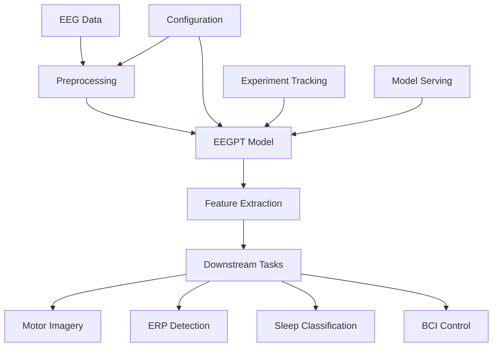

# Brain Go Brrr 🧠⚡

A cutting-edge digital twin brain-computer interface project focused on EEG signal processing and neural representation learning using the EEGPT transformer architecture.

## 🎯 Overview

Brain Go Brrr is a modern Python framework for EEG signal processing and neural representation learning. Built around the EEGPT (EEG Pretrained Transformer) architecture, it provides state-of-the-art tools for brain-computer interface development and neural signal analysis.

## ✨ Key Features

- **🧠 EEGPT Integration**: Pre-trained transformer models for universal EEG representation
- **⚡ High Performance**: Optimized for speed with modern Python tooling (uv, ruff)
- **🔧 Modern Architecture**: Clean, testable codebase with comprehensive CI/CD
- **📊 MLOps Ready**: Integrated experiment tracking, model versioning, and deployment
- **🎨 Rich CLI**: Beautiful command-line interface with Typer and Rich
- **📚 Comprehensive**: From preprocessing to deployment

## 🚀 Quick Start

```bash
# Install with uv (recommended)
uv pip install brain-go-brrr

# Or with pip
pip install brain-go-brrr

# Train a model
brain-go-brrr train --data /path/to/eeg/data

# Evaluate performance
brain-go-brrr evaluate /path/to/model /path/to/test/data

# Serve via REST API
brain-go-brrr serve /path/to/model
```

## 🏗️ Architecture



## 🔬 Research Foundation

Based on the paper "EEGPT: Pretrained Transformer for Universal and Reliable Representation of EEG Signals":

- **10M+ parameters**: Large-scale pretrained transformer
- **Multi-task learning**: Universal EEG representation
- **State-of-the-art**: Superior performance across multiple benchmarks
- **Hierarchical processing**: Separate spatial and temporal modeling

## 📊 Applications

- **Motor Imagery Classification**: Decode intended movements from EEG
- **Event-Related Potentials**: Identify neural responses to stimuli
- **Sleep Stage Classification**: Automated sleep pattern analysis
- **Brain-Computer Interface**: Real-time neural control systems
- **Neurofeedback**: Closed-loop brain training applications

## 🛠️ Development

```bash
# Clone the repository
git clone https://github.com/Clarity-Digital-Twin/brain-go-brrr.git
cd brain-go-brrr

# Setup development environment
make dev-setup

# Run tests
make test

# Check code quality
make check

# Build documentation
make docs
```

## 🤝 Contributing

We welcome contributions! Please see our [Contributing Guide](development/contributing.md) for details.

## 📄 License

This project is licensed under the MIT License - see the LICENSE file for details.

## 🙏 Acknowledgments

- Original EEGPT paper and implementation
- MNE-Python for EEG processing utilities
- Hugging Face Transformers for model architecture
- The open-source neuroscience community

---

**Ready to make your brain go brrr?** 🧠⚡ Start with our [Quick Start Guide](getting-started/quickstart.md)!
