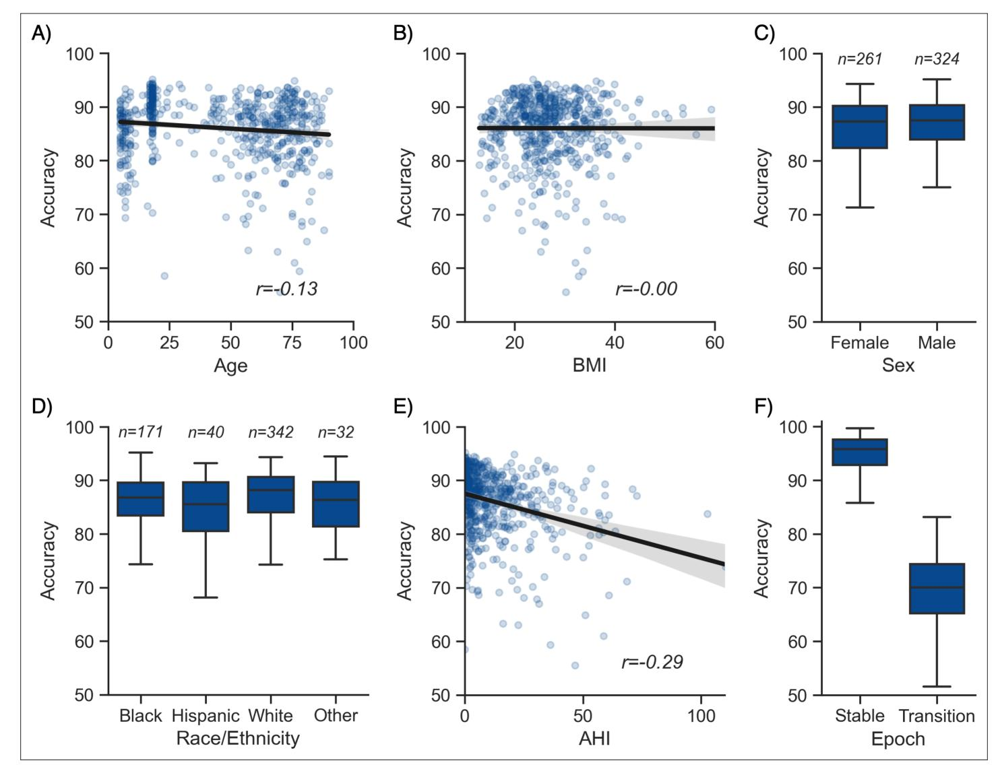

# Figures and figure supplements

An open-source, high-performance tool for automated sleep staging

Raphael Vallat and Matthew P Walker

Figure 1. Performance of the algorithm on the testing set 1 (n = 585 nights). (A) Accuracy of all the testing nights, stratified by dataset. The median accuracy across all testing nights was 87.5%. (B) Correlation between accuracy and average confidence levels (in %) of the algorithm. The overall confidence was calculated for each night by averaging the confidence levels across all epochs. (C) Confusion matrix. The diagonal elements represent the percentage of epochs that were correctly classified by the algorithm (also known as sensitivity or recall), whereas the off-diagonal elements show the percentage of epochs that were mislabeled by the algorithm. (D) Duration of each stage in the human (red) and automatic scoring (green), calculated for each unique testing night and expressed as a proportion of the total duration of the polysomnography (PSG) recording.

Figure 1—figure supplement 1. Confusion matrices of the testing set 1, stratified by dataset. The diagonal elements of the confusion matrices represent the percentage of epochs that were correctly classified by the algorithm (also known as sensitivity or recall), whereas the off-diagonal elements show the percentage of epochs that were mislabeled by the algorithm.

Figure 1—figure supplement 2. Distribution of confidence scores across sleep stages in the testing set 1. The percent of epochs that were flagged as high-confidence (≥ 80%) by the algorithm was 86.3% for wakefulness (out of a total of 253,471 epochs), 17.5% for N1 (n = 32,783), 62.4% for N2 sleep (n = 249,055), 72.1% for N3 sleep (n = 91,712), and 66.9% for rapid eye movement (REM) sleep (n = 89,346).

Figure 1—figure supplement 3. Performance of the YASA, *Stephansen et al., 2018*, and *Perslev et al., 2021* algorithms on the DOD-Healthy testing set (n = 25 healthy adults). *Top*, F1-scores. *Bottom*, confusion matrices. The diagonal elements represent the percentage of epochs that were correctly classified by the algorithm (also known as sensitivity or recall), whereas the off-diagonal elements show the percentage of epochs that were mislabeled by the algorithm.

Figure 1—figure supplement 4. Confusion matrices of each individual human scorer on the DOD-Healthy testing set (n = 25 healthy adults). Ground truth was defined as the unbiased consensus scoring, that is, excluding the current scorer (see Materials and methods). The diagonal elements of the confusion matrices represent the percentage of epochs that were correctly classified by the human scorer (also known as sensitivity or recall), whereas the off-diagonal elements show the percentage of epochs that were mislabeled by the human scorer.

Figure 1—figure supplement 5. Performance of the YASA, *Stephansen et al., 2018*, and *Perslev et al., 2021* algorithms on the DOD-Obstructive testing set (n = 50 patients with obstructive sleep apnea). *Top*, F1-scores. *Bottom*, confusion matrices. The diagonal elements represent the percentage of epochs that were correctly classified by the algorithm (also known as sensitivity or recall), whereas the off-diagonal elements show the percentage of epochs that were mislabeled by the algorithm.

Neuroscience

Figure 1—figure supplement 6. Confusion matrices of each individual human scorer on the DOD-Obstructive testing set (n = 50 patients with sleep apnea). Ground truth was defined as the unbiased consensus scoring, that is, excluding the current scorer (see Materials and methods). The diagonal elements of the confusion matrices represent the percentage of epochs that were correctly classified by the human scorer (also known as sensitivity or recall), whereas the off-diagonal elements show the percentage of epochs that were mislabeled by the human scorer.

Figure 1—figure supplement 7. Top 20 most important features of the classifier. The algorithm uses three different versions of all time-domain and frequency-domain features: (1) the raw feature, expressed in the original unit of data and calculated for each 30-sec epoch, (2) a smoothed and normalized version of that feature using a 7.5 min triangular-weighted rolling average, and (3) a smoothed and normalized version of that feature using a past 2 min rolling average. Importance was measured on the full training set during model training using Shapley values (SHAP).

Figure 2. Moderator analyses. Accuracy of the testing nights as a function of age (A), body mass index (BMI) (B), sex (C), race (D), apnea-hypopnea index (AHI) (E), and whether or not the epoch is around a stage transition (F). An epoch is considered around a transition if a stage transition, as defined by the human scoring, is present within the 3 min around the epoch (1.5 min before, 1.5 min after).

Figure 3. Example of data and sleep stages prediction in one subject. (A) Predicted and ground-truth ( = human-scored) hypnogram in a healthy young female (CFS dataset, 24 years old, Black, apnea-hypopnea index [AHI] < 1). The agreement between the two scoring is 94.3 %. (B) Corresponding fullnight spectrogram of the central electroencephalogram (EEG) channel. Warmer colors indicate higher power in these frequencies. This type of plot can be used to easily identify the overall sleep architecture. For example, periods with high power in frequencies below 5 Hz most likely indicate deep nonrapid eye movement (NREM) sleep. (C) Algorithm's predicted cumulative probabilities of each sleep stage at each 30 s epoch. The black line indicates the confidence level of the algorithm. Note that all the plots in this figure can be very easily plotted in the software.

Figure 3—figure supplement 1. Code snippet illustrating the simplest usage of the algorithm. Here, automatic sleep staging is applied on an European Data Format (EDF) file, previously loaded using the MNE package. The sleep stages predictions are made using one electroencephalogram (EEG), one electrooculogram (EOG), and one electromyogram (EMG), as well as the age and sex of the participant. The full hypnogram is then exported into a CSV file, together with the epoch number.

Figure 3—figure supplement 2. Code snippet illustrating the usage of the algorithm on multiple European Data Format (EDF) files. Automatic sleep staging is applied on a batch of EDF files that are present in the same folder. The sleep stages predictions are made using one electroencephalogram (EEG), one electrooculogram (EOG), and one electromyogram (EMG), which are assumed to be consistent across all the polysomnography recordings. The full predicted hypnogram of each recording is then exported into a CSV file with the same filename as the corresponding EDF file.